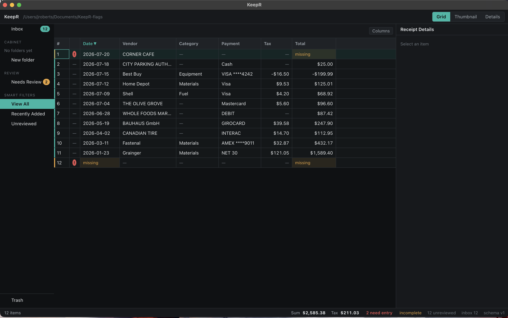

# KeepR

**Offline-first receipt, expense, and document management.** Point it at a pile of
receipt images or PDFs; it reads them, extracts the fields, and gives you a
searchable, reportable library that lives entirely on your own disk.

No account. No cloud. No telemetry. The library is a SQLite file and a folder of
images, both documented, both yours.



> **Status: pre-release (v0.1.0).** The core works end to end — import, OCR,
> extraction, search, splitting, export, backup — and it is not finished. Read
> [Project status](#project-status) before relying on it for anything that matters,
> like your taxes.

---

## Why this exists

Commercial receipt managers want a subscription and a copy of your financial
history. The good desktop one (NeatWorks) was discontinued and its libraries are
awkward to get out of. KeepR is an attempt at the same job with three rules:

1. **Your data stays local**, in formats you can read without this application.
2. **A wrong number is worse than a missing one.** Where extraction is unsure it
   says so instead of guessing, because a plausible wrong total is one you file.
3. **Money is never a floating-point number.** Amounts are integer minor units
   from the database to the screen.

## What works today

| Area | State |
|---|---|
| Import images (JPEG/PNG/TIFF/BMP/WEBP), PDF, vCard | working |
| OCR with bundled Tesseract, fully offline | working |
| Field extraction — date, vendor, total, tax, payment type | working, measured below |
| Folder hierarchy, Inbox review queue | working |
| Editable grid, virtualized to 10k+ rows | working |
| Full-text search over OCR text *and* structured fields | working |
| Receipt splitting into multiple transactions | working |
| Flagging: what OCR could not read or is unsure about | working |
| CSV / Excel / searchable-PDF export | working |
| Backup, restore, archive, trash | working |
| Scanner — eSCL/AirScan network devices | working |
| Scanner — ScanSnap and other non-eSCL (folder watch) | working; see [Scanning](docs/scanning.md) |
| Virtual printer | **not built** |
| Reporting suite (expense reports with cover pages) | **not built** |
| Accounting bridges (QIF/OFX, QuickBooks) | **not built** |

## Extraction accuracy, measured

Run against a 12-receipt synthetic corpus (`spikes/corpus`) chosen to be awkward:
SUBTOTAL directly above TOTAL, a tip line after the total, European decimal commas,
two separate tax lines, a refund, a total printed without decimals, two TOTAL
lines, and a receipt with no total at all. Each is degraded with rotation, blur,
speckle and reduced contrast.

| Field | Correct | Missing | **Wrong** |
|---|---|---|---|
| total | 11 | 1 | **0** |
| tax | 11 | 1 | **0** |
| date | 11 | 1 | **0** |
| vendor | 11 | 1 | **0** |
| payment type | 11 | 1 | **0** |

**11 of 12 fully correct, zero wrong values.** The failure is a heavily faded,
skewed receipt that OCR reads at 0.18 confidence — and it fails *safely*, reporting
every field as missing and flagging itself for manual entry rather than inventing
anything.

Reproduce it:

```bash
npm run corpus            # generate the corpus
npm run corpus:analyze    # import through the real pipeline and score it
```

That number is from synthetic receipts. Real thermal paper photographed on a desk
will be harder, and improving it is [where help is most useful](#contributing).

## Install

Pre-built downloads are on the [releases page](../../releases). Both are unsigned,
so:

- **Windows** — SmartScreen will warn. More info → Run anyway.
- **macOS** — right-click → Open the first time (Gatekeeper).

Or build it yourself, below.

## Build from source

Requires Node 20+ and a C++ toolchain for the native modules.

```bash
git clone https://github.com/BlinkingSun/keepr.git
cd keepr
npm ci
npm start                 # builds and opens the app
```

**One gotcha that will confuse you.** `better-sqlite3` is a native addon, and Node
and Electron have different ABIs, so a build for one cannot load in the other.
Every npm script rebuilds for the runtime it is about to use, so prefer the scripts:

| Command | Rebuilds for | Does |
|---|---|---|
| `npm start` | Electron | Build all bundles, open the app |
| `npm test` | Node | Unit tests |
| `npm run test:schema` | Node | Adversarial schema assertions |
| `npm run serve` | Node | Headless backend + HTTP API on `127.0.0.1:17915` |
| `npm run abi:check` | — | Native + offline gate under Electron |

If you see `NODE_MODULE_VERSION`, you ran something directly instead of through a
script. `npm run rebuild:node` or `npm run rebuild:electron` fixes it.

Full detail: [DEVELOPING.md](DEVELOPING.md).

## Architecture in one screen

```
main process        one SQLite connection, file store, job queue, IPC,
                    HTTP API on 127.0.0.1:17915 for headless testing
  |
  +-- sharp/pdf worker pool          decode, thumbnail, rotate, rasterize
  +-- tesseract.js scheduler         OCR, sized separately and never nested
  +-- preload (contextBridge)        the entire renderer surface, nothing more
  +-- renderer (React)               UI only: no fs, no db, no raw ipc
```

The library on disk:

```
<library>/
  library.sqlite      schema + full-text index
  images/aa/bb/<sha256>.jpg    content-addressed, so duplicates store once
```

Content addressing means importing the same receipt twice stores one file, and the
hash is verifiable proof that three children of a split cite the same image.

## Scanning

KeepR drives **eSCL (AirScan)** network scanners from the Scan dialog. Devices
that do not speak eSCL — every ScanSnap model, and many Brother/Canon units even
over Wi-Fi — scan through their own software into the library's **New Receipts**
folder; KeepR imports files that land there and moves them to **Old Receipts**.

Full setup, including the exact ScanSnap Home profile (**Type must be
`Mac (Scan to file)`**, not Manage-in-Home): **[docs/scanning.md](docs/scanning.md)**.

## Things worth knowing before you contribute

These are not style preferences. Each came out of an audit or a bug, and each has a
test that fails if you break it.

1. **Money is integer minor units.** `84.37` is `8437`. Never a float, never a
   formatted string.
2. **Never `SUM` from `receipt_data` or `item`.** Totals come from
   `v_summable_receipts`, tax from `v_summable_tax`. A naive sum double-counts a
   split receipt — the schema test proves it returns 20000 where the truth is 10000.
3. **Never list a superseded split origin in a view showing totals.** The grid does
   not sum, it displays, and the user does the arithmetic. An origin beside its own
   children makes the visible amounts add to double, under a correct footer.
4. **Totals are always per-currency.** One blended figure across USD and EUR is a
   lie with a currency symbol in front of it.
5. **Word bounding boxes are in stored-master pixel space.** Rotation is metadata
   only and is never also baked into the file. A crop invalidates OCR.
6. **Do not nest worker pools.** `tesseract.js` runs its own threads.
7. **No network at runtime.** The wasm core and language data are bundled.
8. **A flag that fires on everything carries no signal.** The confidence threshold
   is derived from measurement, not taste — see `LOW_CONFIDENCE_THRESHOLD`.

## Contributing

Yes please. The most useful contributions, roughly in order:

1. **Extraction accuracy on real receipt formats.** Add a case to
   `spikes/corpus/generate.ts` that currently fails, then fix it. Do not upload
   photographs of real receipts — they are someone's financial records. The corpus
   is synthetic on purpose.
2. **Broader scanner drivers** (TWAIN on Windows, ImageCaptureCore on macOS).
   eSCL/AirScan and the New Receipts folder path already work; see
   [docs/scanning.md](docs/scanning.md). ScanSnap cannot be driven over the
   network by any third-party app — that is a device limitation, not a gap to fill.
3. **The reporting suite** — expense reports with cover pages and embedded images.
4. **A local vision-model OCR provider.** `OcrProvider` is a swappable seam
   precisely so this can be added without touching anything above it.
5. **Linux packaging and testing.** It should work; nobody has tried.

See [CONTRIBUTING.md](CONTRIBUTING.md) for the workflow, and
[docs/audits](audit/) if you want to know *why* the schema looks the way it does —
those are the real review transcripts, including the bugs that were caught.

## Project status

Honest assessment, because deciding whether to trust software with your tax
records deserves one:

- **Solid:** the data model. Money handling, split integrity, and backup
  verification have been through three audit cycles and are covered by 254 tests
  plus adversarial schema assertions that try to break the invariants.
- **Good:** import, OCR, extraction, search, export, flagging. All work end to end
  and are measured, not assumed.
- **Missing:** TWAIN/ICA capture, the virtual printer, the reporting suite,
  accounting exports. eSCL network scan and the watched New Receipts folder path
  are in; see [docs/scanning.md](docs/scanning.md). See the table above.
- **Untested:** Linux entirely. Real-world OCR at volume. Libraries larger than a
  few thousand items.

Do not make KeepR the only copy of anything yet. Back up your library.

## License

[MIT](LICENSE).
